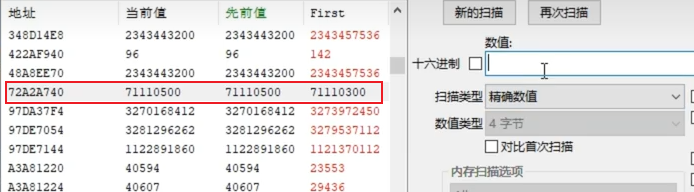

## 如何查找技能ID

- 方式一、鼠标选中 搜索
  变动，不变 搜索。不变-点几个回来-不变。搜索。

对比首次结果。很工整且和首次值有规律。可能就是技能ID
- 方式二、当前释放搜索
  普攻有3段。第一下小，第二大，第三大。
- 方式三、搜技能等级
  切换搜索技能等级，查看附近内存地址。

## 查找冷却Call
可用时为1 不可用（冷却时为0）参考 植物大战僵尸冷却基址

1. 搜索到冷却地址-A
2. X64dbg, 左下角内存窗口 Ctrl+G跳到A, 下硬件断点断下
3. 取消硬件断点
4. 慢慢找, 如果值来自 ebp-4 就看上一层的参数1
5. 在函数首行下断点，查看右下角的栈地址
6. 如果追到 一个地方循环了在最后一步(比如关联的是esi), 在此call的头部比如push esi(和esi相关的地方) 断下来 
   1. CE搜索 0019xxx是堆栈地址不用看 找到有效地址比如 0x3c3b8e8
   2. 左下内存窗口， Ctrl+G 0x3c3b8e8 跳过去硬件访问断下
   3. 再继续向上找
# 常见数据

0-7 角色面向方向

# Artcile
## 实例

### 植物大战僵尸
x[[逆向分析]纯OD/DBG分析植物大战僵尸冷却基址,涉及知识点ESP寻址](https://www.bilibili.com/video/BV1e1vxBnEy1)
x[[逆向分析]纯od/dbg分析植物大战僵尸阳光基址](https://www.bilibili.com/video/BV1divyBuEg9)